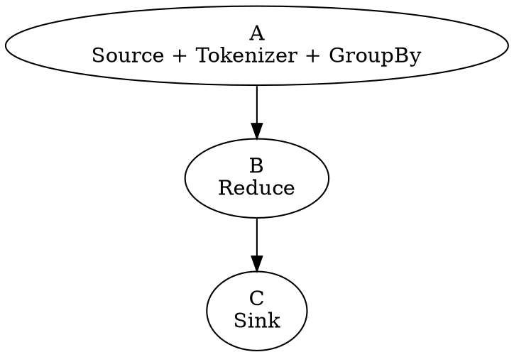

Meeting Tesi 2021-03-15
===

:::info
- **Location:** Skype
- **Date:** 2021-03-15
- **Agenda**
  1. Work before the publish of threads version
  2. Notes on Alessio's new version
- **Participants:**
    - Alessandro Margara (AM)
    - Gianpaolo Cugola (GC)
    - Marco Donadoni (MD)
    - Edoardo Morassutto (EM)

:::

## Work before the publish of threads version

We implemented an ad-hoc (_lower-bound_) version of wordcount with threads and channels.
Experiments with:

- Core affinity
- Channel library
- Core count

All the tests are done using the gunteberg dataset, replicated three times.

### Architecture

$N$ threads for `A`, $N$ threads for `B`, 1 thread for `C`.

Channel $A \rightarrow B$ has fixed batching sized 1000.

**Note**: `A` is much more CPU-intensive than `B` and `C`.

### Core affinity

**Idea**: place `A` in fixed cores to stop the kernel moving it around and hopefully improve cache performance. If $N \le$ physical cores, avoid assigning `A` to hyperthreaded cores.

Experiments with **crossbeam**.

| Cores | Affinity | No affinity |
| ----- | -------- | ----------- |
| 1     | 22.1     | 21.6        |
| 2     | 11.6     | 11.7        |
| 3     | 8.3      | 8.4         |
| 4     | 6.2      | 6.5         |
| 5     | 23.9     | 6.2         |
| 6     |          | 8.9         |
| 7     |          | 11.7        |
| 8     |          | 18.8        |

**Result**: Not significant improvements in best case, very disappointing in worst case.

### Channel library

With **crossbeam** and 4 cores, a mapper:

With **crossbeam** and 8 cores, a mapper:

With **standard library channels** and 8 cores, a mapper:

The reducers behave pretty similarly.

Experiments without core affinity.

| Cores | Crossbeam unbounded | Crossbeam bounded | std channel | rstream (2t+2) |
| ----- | ------------------- | ----------------- | ----------- | -------------- |
| 1     | 21.6                |                   | 21.8        | 28.7           |
| 2     | 11.7                |                   | 15.7        | 14.7           |
| 3     | 8.4                 |                   | 8.1         | 11.6           |
| 4     | 6.5                 |                   | 6.4         | 10.0           |
| 5     | 6.2                 | 7.0               | 6.2         | 8.9            |
| 6     | 8.9                 |                   | 5.7         | 8.8            |
| 7     | 11.7                |                   | 6.4         | 8.9            |
| 8     | 18.8                | 18.9              | 5.9         | 9.0            |

**Result**: In our particular case crossbeam is the bottleneck with more than 4 threads.
Maybe related to [#366](https://github.com/crossbeam-rs/crossbeam/issues/366).

## Notes on Alessio's new version

We focused only on wordcount.

- The file reader batches 10k lines at the time
- He uses `FxHashMap` instead of `HashMap`: ~0.1s (probably in margin of error)
- The group_by-reduce is associative:
    - Block `A` and `B` are merged together
    - Very very low network usage
- GroupBy does full-batching storing all the accumulated partial results in ram

Forcing the Alessio's version to be non-associative:
- Sinks actually do some work
- Memory usage is reasonable

| Version                | time |
| ---------------------- | ---- |
| LB non assoc           | 5.9  |
| LB assoc               | 4.2  |
| RS threads non assoc¹  | 10.7 |
| RS threads assoc       | 4.2  |
| RS processes non assoc | 9.1  |
| RS processes assoc     | 5.4  |
| master                 | 13.5 |
| tokio                  | 16.4 |

¹ quickly patched

## Meeting notes

- Need to make tests also with the network in order to see what happens with back-pressure
- The network threads may be async-await
- `sola1.dei.polimi.it` / `sola3.deib.polimi.it`
- Note interesting algorithms for other students